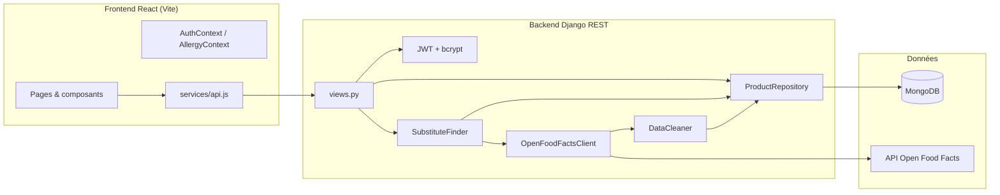

# FoodFacts Hub

WebApp **Django + React** pour trouver des **substituts alimentaires plus sains** à partir des données ouvertes [Open Food Facts](https://world.openfoodfacts.org).

Projet réalisé dans le cadre du module Open Data (IPSSI).

---

## Vue d'ensemble (end-to-end)

### Ce que fait l'application

1. L'utilisateur **découvre des produits** (par catégorie, recherche texte ou code-barres).
2. Il consulte une **fiche produit** (Nutri-Score, NOVA, Eco-Score, allergènes, ingrédients, magasins).
3. Il demande un **substitut plus sain** dans la même catégorie, éventuellement **sans ses allergènes**.
4. S'il est connecté, il peut **enregistrer** le substitut dans « Mes aliments substitués » (MongoDB).

### Parcours utilisateur

```
Accueil (/) ──► Parcourir par catégorie ou recherche texte
              ──► Sélectionner un produit ──► Fiche produit (/product/:barcode)
              ──► Trouver un substitut ──► Résultat (/result)
              ──► [Connecté] Enregistrer ──► Mes substituts (/substitutions)

Code-barres (/barcode) ──► Lookup EAN ──► Substitut ──► Résultat

Contribuer (/contribuer) ──► Liens vers la communauté Open Food Facts
```

### Flux technique



**Stratégie cache :** MongoDB sert de cache local (`products_cache`). L'API OFF n'est appelée que si le cache est insuffisant ou absent. Les produits consultés sont automatiquement mis en cache pour accélérer les recherches suivantes.

---

## Fonctionnalités

| Domaine | Détail |
|---|---|
| **Découverte** | 12 catégories populaires (biscuits, sodas, chips…), recherche texte, code-barres |
| **Fiche produit** | Nutri-Score, NOVA, Eco-Score, allergènes, ingrédients, magasins, lien OFF |
| **Substituts** | Recommandation par Nutri-Score (même catégorie), jusqu'à 2 alternatives |
| **Allergènes** | Profil allergènes (local + compte), filtrage catalogue, substituts « sans allergènes » |
| **Compte** | Inscription / connexion JWT, profil allergènes synchronisé |
| **Historique** | Produits récents (localStorage), substituts enregistrés avec statistiques |
| **Contribution** | Page d'orientation vers Open Food Facts pour enrichir la base open data |

---

## Logique de substitution

Le service `SubstituteFinder` :

1. Résout le produit d'origine (cache MongoDB → sinon API OFF).
2. Identifie sa `category_tag` (ex. `en:chocolate-spreads`).
3. Cherche des candidats **locaux** avec un Nutri-Score strictement meilleur (A < B < C < D < E).
4. Si pas assez de candidats locaux (seuil : 5), interroge l'API OFF par grade nutritionnel.
5. Filtre les candidats selon les **allergènes déclarés** par l'utilisateur (si activé).
6. Sélectionne le meilleur substitut (Nutri-Score, puis présence magasins/image).
7. Propose jusqu'à **2 alternatives** et calcule l'amélioration (Nutri-Score, delta NOVA).
8. Met en cache les produits trouvés dans MongoDB.

---

## Architecture

```
Open_Food_Facts/
├── backend/                    # API Django REST
│   ├── api/
│   │   ├── views.py            # Endpoints REST
│   │   ├── models.py           # Documents MongoEngine
│   │   ├── authentication.py   # JWT + bcrypt
│   │   ├── allergens.py        # Liste & détection allergènes
│   │   └── services/
│   │       ├── off_client.py       # Client HTTP Open Food Facts
│   │       ├── data_cleaner.py     # Normalisation des données OFF
│   │       ├── repository.py       # CRUD MongoDB & cache
│   │       └── substitute_finder.py # Algorithme de recommandation
│   ├── scripts/seed_data.py    # Peuplement initial (catégories + produits)
│   └── pur_beurre/             # Configuration Django
├── frontend/                   # Interface React (Vite)
│   └── src/
│       ├── pages/              # Dashboard, BarcodeFlow, ProductDetail, etc.
│       ├── components/         # ProductCard, NutriScore, AllergyBar, etc.
│       ├── context/            # AuthContext, AllergyContext
│       ├── services/api.js     # Client Axios vers le backend
│       └── utils/              # allergènes, nutrition, produits récents
├── package.json                # Scripts dev (concurrently)
├── docker-compose.yml          # MongoDB local optionnel
└── DEPLOYMENT.md               # Guide Atlas + Render + Vercel
```

### Collections MongoDB

| Collection | Rôle |
|---|---|
| `users` | Comptes, hash mot de passe (bcrypt), allergènes déclarés |
| `categories` | Catégories d'aliments (tags OFF) |
| `products_cache` | Produits nettoyés, indexés par barcode / catégorie / Nutri-Score |
| `substitutions` | Substituts enregistrés par utilisateur |

### Stack technique

| Couche | Technologies |
|---|---|
| Frontend | React 18, React Router, Vite, Axios |
| Backend | Django 5, Django REST Framework |
| Base | MongoDB (MongoEngine), pas de SQLite/PostgreSQL |
| Auth | JWT (PyJWT), bcrypt |
| Données externes | API Open Food Facts v2 + fallback legacy |
| Dev | concurrently, Docker Compose (Mongo local) |
| Prod | MongoDB Atlas, Render (API), Vercel (frontend) |

---

## Routes frontend

| Route | Page | Accès |
|---|---|---|
| `/` | Dashboard — parcourir / rechercher | Public |
| `/barcode` | Recherche par code-barres | Public |
| `/product/:barcode` | Fiche produit détaillée | Public |
| `/result` | Résultat de substitution | Public |
| `/contribuer` | Contribuer à Open Food Facts | Public |
| `/substitutions` | Mes aliments substitués | Connecté |
| `/login`, `/register` | Authentification | Public |

---

## Endpoints API

| Méthode | Route | Description | Auth |
|---|---|---|---|
| GET | `/api/health/` | Santé de l'API | — |
| POST | `/api/auth/register/` | Inscription | — |
| POST | `/api/auth/login/` | Connexion (retourne JWT) | — |
| GET | `/api/auth/me/` | Profil utilisateur | JWT |
| PATCH | `/api/auth/me/` | Mettre à jour les allergènes | JWT |
| GET | `/api/allergens/` | Liste des allergènes courants | — |
| GET | `/api/categories/` | Catégories populaires | — |
| GET | `/api/categories/products/?category_tag=...` | Produits par catégorie | — |
| GET | `/api/search/?q=...` | Recherche texte | — |
| GET | `/api/products/<barcode>/` | Produit par code-barres | — |
| POST | `/api/substitute/` | Trouver un substitut | — |
| POST | `/api/substitutions/save/` | Enregistrer un substitut | JWT |
| GET | `/api/substitutions/` | Mes substituts | JWT |
| DELETE | `/api/substitutions/<id>/` | Supprimer un substitut | JWT |

---

## Prérequis

- Python 3.11+
- Node.js 18+
- MongoDB : [MongoDB Atlas](https://www.mongodb.com/atlas) (recommandé) ou Docker local

## Lancer l'app en une seule commande

**Première fois** (installation) :

```powershell
cd backend
python -m venv .venv
.\.venv\Scripts\activate
pip install -r requirements.txt
copy .env.example .env
# Éditez .env : MONGODB_URI Atlas (voir section ci-dessous) ou local
cd ..
npm run install:all
npm run seed
```

**Ensuite, à chaque session** :

```powershell
npm run dev
```

Ou :

```powershell
.\start-dev.ps1
```

- Frontend : http://localhost:5173
- Backend : http://127.0.0.1:8080/api/ (port 8080 : le 8000 est souvent bloqué sous Windows)

MongoDB : **Atlas** (recommandé) ou local (`docker compose up -d`).

---

## Installation rapide (détaillée)

### 1. MongoDB

**Option A — MongoDB Atlas (recommandé)**

Voir la section [Configuration MongoDB Atlas](#configuration-mongodb-atlas) ci-dessous.

**Option B — MongoDB local (Docker)**

```bash
docker compose up -d
```

Puis dans `backend/.env` :

```
MONGODB_URI=mongodb://localhost:27017/pur_beurre
MONGODB_DB=pur_beurre
```

### 2. Backend Django

```bash
cd backend
python -m venv .venv

# Windows
.venv\Scripts\activate

# Linux / macOS
source .venv/bin/activate

pip install -r requirements.txt
cp .env.example .env
# Éditez .env avec votre MONGODB_URI (Atlas ou local)

python manage.py check
python scripts/seed_data.py
python manage.py runserver 8080
```

API disponible sur : http://127.0.0.1:8080/api/

### 3. Frontend React

```bash
cd frontend
npm install
npm run dev
```

Interface sur : http://localhost:5173

Variables d'environnement frontend (`.env` ou Vercel) :

```
VITE_API_URL=http://127.0.0.1:8080/api
```

En dev, le proxy Vite peut aussi rediriger `/api` vers le backend si `VITE_API_URL` est absent.

---

## Configuration MongoDB Atlas

### 1. Créer le cluster

1. Connectez-vous sur [MongoDB Atlas](https://cloud.mongodb.com).
2. Créez un cluster (gratuit M0 suffit pour le développement).
3. Créez la base `pur_beurre` (ou laissez-la se créer automatiquement au premier seed).

### 2. Utilisateur de base de données

Dans **Database Access** → **Add New Database User** :

- Créez un utilisateur avec mot de passe (notez-le).
- Rôle recommandé en dev : **Read and write to any database**.

### 3. Accès réseau

Dans **Network Access** → **Add IP Address** :

- **Add Current IP Address** pour le développement local.
- **Allow Access from Anywhere** (`0.0.0.0/0`) si vous déployez sur Render/Vercel (voir [DEPLOYMENT.md](./DEPLOYMENT.md)).

### 4. URI de connexion

Dans **Database** → **Connect** → **Drivers** → **Python**, copiez l'URI :

```
mongodb+srv://<user>:<password>@<cluster>.mongodb.net/?retryWrites=true&w=majority
```

Remplacez `<user>` et `<password>`. Si le mot de passe contient des caractères spéciaux (`@`, `#`, `%`…), encodez-les en URL (ex. `@` → `%40`).

### 5. Fichier `backend/.env`

```env
MONGODB_URI=mongodb+srv://<user>:<password>@<cluster>.mongodb.net/pur_beurre?retryWrites=true&w=majority
MONGODB_DB=pur_beurre
```

### 6. Peupler la base (seed)

```powershell
python manage.py check
python scripts/seed_data.py
```

Le script télécharge ~15 produits par catégorie depuis OFF et crée les collections `users`, `categories`, `products_cache`, `substitutions`.

### 7. Lancer l'application

```powershell
npm run dev
```

---

## Déploiement (accessible partout)

Guide pas à pas : **[DEPLOYMENT.md](./DEPLOYMENT.md)**

Résumé : **MongoDB Atlas** + **Render** (API Django) + **Vercel** (frontend React).

1. Atlas : Network Access `0.0.0.0/0`, puis `python scripts/seed_data.py` en local.
2. Render : service web dans `backend/`, variables `MONGODB_URI`, `ALLOWED_HOSTS`, `CORS_ALLOWED_ORIGINS`.
3. Vercel : projet dans `frontend/`, variable `VITE_API_URL=https://votre-api.onrender.com/api`.

---

## Exemple de scénario complet

1. **Marie** ouvre l'accueil, choisit la catégorie « Pâtes à tartiner ».
2. Le backend renvoie des produits depuis le cache MongoDB (ou OFF si cache vide).
3. Elle sélectionne le Nutella (`8000500310427`), consulte la fiche (Nutri-Score E).
4. Elle déclare une allergie au **lait** dans la barre allergènes.
5. Elle clique « Substitut sans mes allergènes ».
6. `SubstituteFinder` cherche dans `en:chocolate-spreads` un produit Nutri-Score A–D sans lait.
7. La page `/result` affiche la comparaison, la raison, et des alternatives.
8. Marie crée un compte, enregistre le substitut → stocké dans `substitutions`.
9. Elle retrouve son historique dans `/substitutions` avec les stats d'amélioration Nutri-Score.

---

## Gestion de projet Agile

- **Trello** : [Ajoutez ici le lien vers votre board Trello](https://trello.com)
- **Présentation** : [Ajoutez ici le lien Google Slides](https://docs.google.com/presentation)

## Équipe & rôles suggérés

| Membre | Rôle | Tâches |
|---|---|---|
| Dev Backend | API Django, services OFF, MongoDB | Fait |
| Dev Frontend | React, parcours utilisateur | Fait |
| DevOps | Atlas, déploiement Render/Vercel | À faire |
| Chef de projet | Trello, présentation | En cours |

## Licence

Projet académique — données © [Open Food Facts](https://world.openfoodfacts.org) (ODbL).
